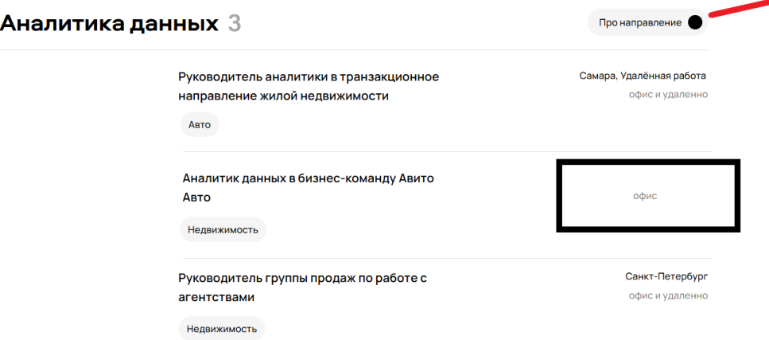
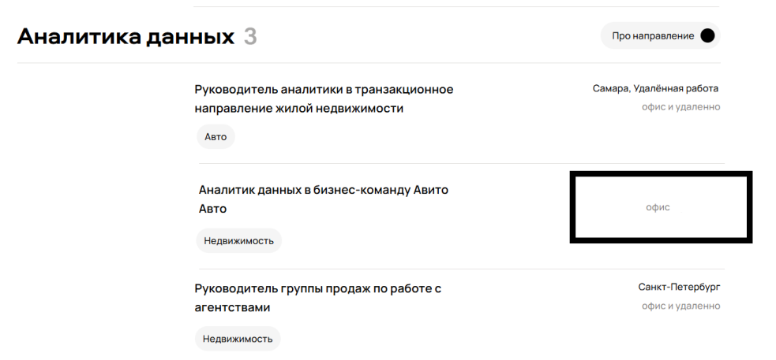
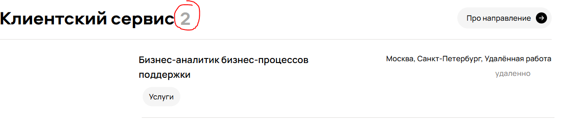
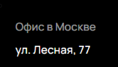
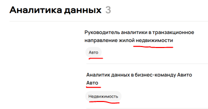
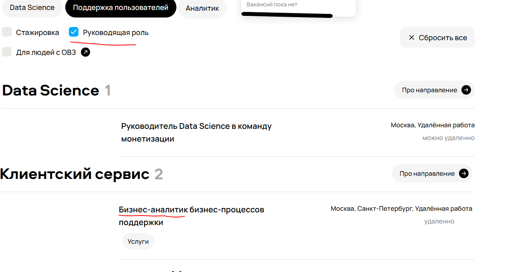
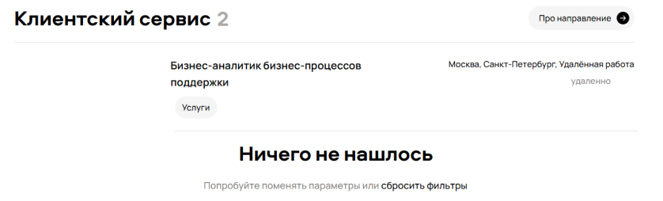
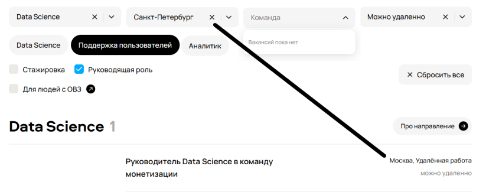
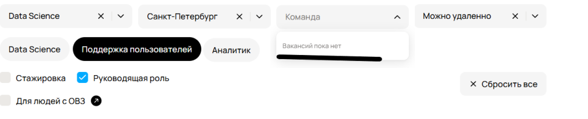
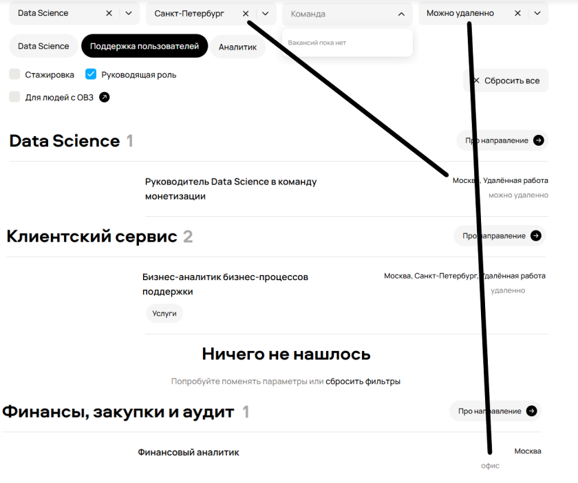

| Описание                               | Критичность | Фото | Объяснение |
|----------------------------------------|------------|------|------------|
| Орфографическая опечатка "227 вакансии открыто"   | low    |  | В подвале сайта орфографическая ошибка, никак не вляет. |
| Отсутсвует стрелка у кнопки  "Про направление" в разделе "Аналитика данных"      | low    |  | Не влияет на работу/бизнес логику сайта. |
| Отсутсвует город у вакансии    | low     |  | Не влияет на работу/бизнес логику сайта. |
| Неправильный подсчет вакансий    | low     |  | Не влияет на работу/бизнес логику сайта. |
| Неправильный адрес офиса    | low     |  | Не влияет на работу/бизнес логику сайта. |
| Неправильные теги вакансии    | low     |  | Не влияет на работу/бизнес логику сайта. |
| Неработающий фильтр    | medium     |  | Фильтры не применяются к вакансии. |
| Картинка не прогрузилась    | low     |  |Не влияет на работу/бизнес логику сайта. |
| Вакансия есть, но пишет что их нет    | medium     |  |Ошибка логики |
| Другой город   | medium     |  | Ошибка логики |
| Команды нет   | low     |  | Не влияет на работу/бизнес логику сайта. |
| Формат работы   | medium     |  | Ошибка логики |

